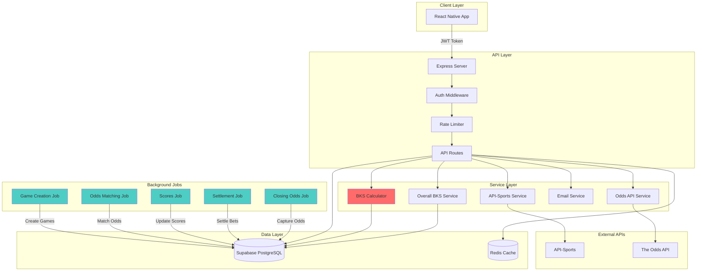
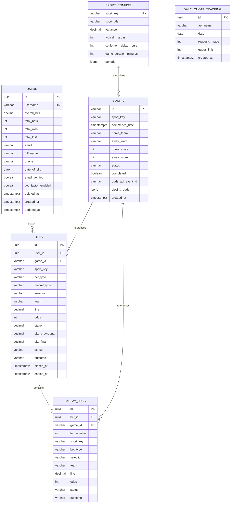
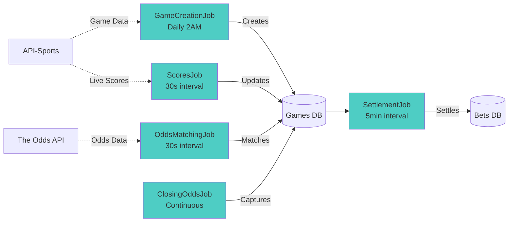

# WhoKnowsBall Backend API

[](https://nodejs.org/)
[](https://expressjs.com/)
[](https://www.typescriptlang.org/)
[](https://supabase.com/)
[](https://redis.io/)
[](LICENSE)

> Backend API service for WhoKnowsBall - A sports betting skill tracker that quantifies betting expertise through the proprietary BKS (Ball Knowing Score) algorithm.

**Live Demo:** [Coming Soon]
**Frontend Repository:** [whoknowsball-frontend](https://github.com/yourusername/whoknowsball-frontend)
**Documentation:** See [CLAUDE.md](./CLAUDE.md) for comprehensive technical context

---

## Overview

The WhoKnowsBall backend is a Node.js/Express/TypeScript API server that powers a no-cost, sports betting skill-tracking platform. Unlike traditional sportsbooks, users don't wager real money - instead, the system evaluates each bet through a sophisticated proprietary algorithm that produces a **Ball Knowing Score (BKS)** from 0-100.

### What Makes This Unique

- **Proprietary BKS Algorithm**: A multi-dimensional scoring system that evaluates betting decisions across 6 key metrics (implementation redacted for IP protection), complete with anti-gaming guardrails, stake-aware scaling, and more
- **No Real Money**: Focus on skill measurement rather than actual gambling
- **Market-Aware Analysis**: Incorporates closing line value (CLV) and de-vigged probabilities
- **Real-Time Processing**: Background jobs for game creation, odds matching, live scores, and bet settlement
- **API Quota Optimization**: Intelligent caching and circuit breaker patterns to stay within tier limits, while maintaining expected in-app experience quality for users

### Key Features

- RESTful API with comprehensive endpoints for betting, games, odds, leaderboards, and user management
- JWT authentication with Supabase Auth integration
- Background job scheduler for game synchronization and bet settlement
- Redis caching for performance optimization
- Row-level security (RLS) for data protection
- Rate limiting and API key authentication
- Email support system with ticket tracking
- Two-factor authentication (2FA) support

---

## Architecture



---

## Database Schema

The backend uses Supabase (PostgreSQL) with the following core schema:



### Key Tables

- **users**: User profiles with BKS statistics (extends Supabase auth.users)
- **games**: Sports events from API-Sports with live scores
- **bets**: User betting history + analytics with BKS scores
- **parlay_legs**: Individual legs for multi-bet parlays (max 10 leg parlays)
- **sport_configs**: Sport-specific configurations (variance, margins, periods)
- **daily_quota_tracking**: API usage monitoring for quota management

---

## API Endpoints

### Authentication

| Method | Endpoint | Description | Auth Required |
|--------|----------|-------------|---------------|
| POST | `/api/v1/auth/register` | Register new user | No |
| POST | `/api/v1/auth/login` | Login with email/password | No |
| POST | `/api/v1/auth/refresh` | Refresh JWT token | No |
| POST | `/api/v1/auth/logout` | Logout user | Yes |
| PUT | `/api/v1/auth/password` | Change password | Yes |
| POST | `/api/v1/auth/2fa/enable` | Enable 2FA | Yes |
| POST | `/api/v1/auth/2fa/disable` | Disable 2FA | Yes |
| POST | `/api/v1/auth/2fa/verify` | Verify 2FA code | No |

### Betting

| Method | Endpoint | Description | Auth Required |
|--------|----------|-------------|---------------|
| POST | `/api/v1/bets` | Place bet (single or parlay) | Yes |
| GET | `/api/v1/bets` | Get user's bets | Yes |
| GET | `/api/v1/bets/:betId` | Get specific bet details | Yes |
| POST | `/api/v1/bets/calculate` | Calculate BKS without placing | No |

### Games & Odds

| Method | Endpoint | Description | Auth Required |
|--------|----------|-------------|---------------|
| GET | `/api/v1/odds/:sport` | Get odds for sport | No |
| GET | `/api/v1/odds/upcoming/all` | Get all upcoming games | No |

### Leaderboards & Stats

| Method | Endpoint | Description | Auth Required |
|--------|----------|-------------|---------------|
| GET | `/api/v1/leaderboard/global` | Global leaderboard | No |
| GET | `/api/v1/leaderboard/sport/:sportKey` | Sport-specific leaderboard | No |
| GET | `/api/v1/leaderboard/stats/user/:username` | Public user stats | No |
| GET | `/api/v1/leaderboard/users/stats` | Current user stats | Yes |
| GET | `/api/v1/leaderboard/users/bks-history` | BKS history chart data | Yes |

### User Profile & Account

| Method | Endpoint | Description | Auth Required |
|--------|----------|-------------|---------------|
| GET | `/api/v1/users/profile` | Get user profile | Yes |
| PUT | `/api/v1/users/profile` | Update profile | Yes |
| PUT | `/api/v1/users/email` | Update email | Yes |
| DELETE | `/api/v1/users/account` | Delete account (soft delete) | Yes |

### Support & Admin

| Method | Endpoint | Description | Auth Required |
|--------|----------|-------------|---------------|
| POST | `/api/v1/support/contact` | Submit support ticket | Yes |
| GET | `/api/v1/support/status` | Check support system status | Yes |
| GET | `/health` | Health check | API Key |
| GET | `/api/v1/health` | Detailed health check | API Key |

---

## Background Jobs Architecture

The backend runs several automated jobs to keep data synchronized and settle bets:



### Job Details

| Job | Interval | Purpose |
|-----|----------|---------|
| **GameCreationJob** | Daily 2AM + startup | Fetches upcoming games from API-Sports for all sports |
| **GameSyncJob** | 3-tier polling | Synchronizes game data with priority-based polling (upcoming/live/completed) |
| **OddsMatchingJob | 30 seconds | Matches Odds API events to games by team names and commence time |
| **ScoresJob** | 30 seconds | Updates live scores from API-Sports for in-progress games |
| **SettlementJob** | 5 minutes | Settles completed bets and calculates final BKS scores |
| **ClosingOddsJob** | Continuous | Captures closing odds at T-2 minutes before game start |
| **StaleGameDetectionJob** | Periodic | Detects and handles stale game data |
| **VerificationCheckJob** | Periodic | Enforces 24-hour email verification deadline |

---

## BKS Algorithm Overview

The **Ball Knowing Score (BKS)** is a proprietary algorithm that evaluates betting skill across six weighted dimensions:

### Algorithm Components

| Component | Description |
|-----------|-------------|
| **Difficulty (D)** | How hard was the bet to win? Based on de-vigged fair probability |
| **Complexity (C)** | Parlay leg count with correlation adjustments |
| **Payout (P)** | Risk/reward potential normalized to reference cap |
| **Accuracy (A)** | Closing Line Value (CLV) - did you beat the market? |
| **Stake (S)** | Conviction measurement via stake percentile |
| **Context (K)** | Game importance (preseason → regular → playoffs → finals) |

See [[here](BKS_ALGORITHM_OPEN_SOURCE.md)] for the full open-source algorithm.

```

### Key Features

- **Deterministic**: Same input always produces same output
- **Market-Aware**: Uses closing odds and de-vigged probabilities
- **State-Based**: Different logic for PENDING/LIVE/SETTLED statuses
- **Capped at 100**: Maximum score is 100.0
- **No Soft Floor**: Poor decisions can score below 10

### Supported Markets

- **h2h**: Head-to-head moneyline (2-way)
- **3way**: Three-way moneyline (home/away/draw)
- **spreads**: Point spreads
- **totals**: Over/under totals

### Supported Sports

- NFL (americanfootball_nfl)
- NBA (basketball_nba)
- MLB (baseball_mlb)
- NHL (icehockey_nhl)
- EPL (soccer_epl)

**Note:** Full algorithm implementation is proprietary and redacted from this repository for intellectual property protection.

---

## Setup Instructions

### Prerequisites

- **Node.js** 20.x LTS
- **npm** or **yarn**
- **Redis** (local or Upstash)
- **Supabase** account
- **API Keys** for API-Sports and The Odds API

### Installation

1. **Clone the repository**
   ```bash
   git clone https://github.com/yourusername/whoknowsball-backend.git
   cd whoknowsball-backend
   ```

2. **Install dependencies**
   ```bash
   npm install
   ```

3. **Configure environment variables**
   ```bash
   cp .env.example .env
   # Edit .env with your actual credentials
   ```

   Required variables:
   ```env
   PORT=3000
   SUPABASE_URL=https://your-project.supabase.co
   SUPABASE_ANON_KEY=your-anon-key
   SUPABASE_SERVICE_KEY=your-service-key
   API_SPORTS_KEY=your-api-sports-key
   ODDS_API_KEY=your-odds-api-key
   REDIS_URL=redis://localhost:6379
   BKS_SECRET=your-secret-key
   API_KEY=your-api-key
   API_KEY_ENABLED=true
   ```

4. **Set up database**

   Run migrations in Supabase SQL editor:
   ```bash
   # Migrations are in supabase/migrations/
   # Run them in order starting with 20251005213936_initial_schema.sql
   ```

5. **Start Redis** (if running locally)
   ```bash
   redis-server
   ```

6. **Run development server**
   ```bash
   npm run dev
   ```

7. **Verify health**
   ```bash
   curl -H "X-API-Key: your-api-key" http://localhost:3000/health
   ```

### Scripts

```bash
npm run dev          # Start with tsx watch mode (hot reload)
npm run build        # Build TypeScript to JavaScript
npm start            # Run production build
npm test             # Run Jest test suite
npm run type-check   # TypeScript type checking
```

---

## Project Structure

```
whoknowsball-backend/
├── src/
│   ├── api/
│   │   └── routes/              # API route handlers
│   │       ├── v1/
│   │       │   └── auth.routes.ts
│   │       ├── bets.routes.ts
│   │       ├── bks.routes.ts
│   │       ├── health.routes.ts
│   │       ├── jobs.routes.ts
│   │       ├── leaderboard.routes.ts
│   │       ├── metrics.routes.ts
│   │       ├── odds.routes.ts
│   │       ├── search.routes.ts
│   │       ├── support.routes.ts
│   │       ├── teams.routes.ts
│   │       ├── test.routes.ts
│   │       └── users.routes.ts
│   ├── config/                  # Configuration files
│   │   ├── apiSportsConfig.ts   # API-Sports configuration
│   │   ├── constants.ts         # App constants
│   │   ├── redis.ts             # Redis client
│   │   ├── supabase.ts          # Supabase client
│   │   └── teamMappings.ts      # Team name normalization
│   ├── middleware/              # Express middleware
│   │   ├── auth.middleware.ts   # JWT verification
│   │   └── security.middleware.ts # API key, rate limiting
│   ├── services/                # Business logic
│   │   ├── bks/                 # BKS algorithm (redacted)
│   │   │   ├── BKSCalculator.ts # Core algorithm
│   │   │   ├── OverallBKSService.ts
│   │   │   └── types.ts
│   │   ├── jobs/                # Background jobs
│   │   │   ├── ClosingOddsJob.ts
│   │   │   ├── GameCreationJob.ts
│   │   │   ├── GameSyncJob.ts
│   │   │   ├── OddsMatchingJob.ts
│   │   │   ├── ScoresJob.ts
│   │   │   ├── SettlementJob.ts
│   │   │   ├── StaleGameDetectionJob.ts
│   │   │   └── VerificationCheckJob.ts
│   │   ├── odds/                # Odds services
│   │   │   ├── ClosingOddsCapture.ts
│   │   │   ├── OddsAPIService.ts
│   │   │   └── OddsEnhancementService.ts
│   │   ├── APISportsService.ts  # API-Sports client
│   │   ├── DailyBKSService.ts   # Daily BKS snapshots
│   │   └── EmailService.ts      # Email sending
│   ├── utils/                   # Utility functions
│   │   ├── gameIdValidation.ts
│   │   ├── quotaCircuitBreaker.ts
│   │   └── twoFactorAuth.ts
│   └── index.ts                 # Express app entry point
├── supabase/
│   └── migrations/              # Database migrations
├── scripts/                     # Utility scripts
├── .env.example                 # Environment template
├── package.json
├── tsconfig.json
├── CLAUDE.md                    # Comprehensive context doc
└── README.md                    # This file
```

---

## Technology Stack

### Core Technologies

- **Runtime**: Node.js 20.x LTS
- **Framework**: Express 4.x
- **Language**: TypeScript 5.3
- **Database**: Supabase (PostgreSQL)
- **Cache**: Redis 5.x
- **Authentication**: Supabase Auth (JWT)

### Key Dependencies

```json
{
  "express": "^4.18.2",
  "@supabase/supabase-js": "^2.74.0",
  "redis": "^5.8.3",
  "axios": "^1.12.2",
  "cors": "^2.8.5",
  "helmet": "^8.1.0",
  "express-rate-limit": "^8.1.0",
  "nodemailer": "^7.0.11",
  "moment-timezone": "^0.6.0",
  "fast-levenshtein": "^3.0.0",
  "uuid": "^13.0.0"
}
```

### External APIs

| API | Purpose | Rate Limit |
|-----|---------|------------|
| **API-Sports** | Game data & live scores | 7,500/day per sport |
| **The Odds API** | Betting odds | ~166,667/day (5M/month) |

---

## Security

### Authentication & Authorization

- JWT tokens via Supabase Auth
- API key authentication for ngrok/public access (`X-API-Key` header)
- Row Level Security (RLS) on all sensitive tables
- Service role key used only for admin operations

### Data Protection

- HMAC-SHA256 signatures on bet placements
- Password requirements: 8+ chars, letter, number
- Two-factor authentication (2FA) support
- Soft delete for user accounts (anonymizes PII)

### Rate Limiting

- Global: 60 requests/min
- BKS endpoints: 10 requests/min
- Support contact: 5 requests/hour per user

### API Quota Management

- Circuit breaker pattern for external APIs
- Redis caching (60s TTL for odds)
- Daily quota tracking in database
- Automatic fallback when limits approached

---

## License

**Proprietary** - All rights reserved.

The BKS algorithm and associated intellectual property are proprietary. This code is provided for portfolio demonstration purposes only. Commercial use, reproduction, or distribution is prohibited without explicit written permission.

Contact: matthew.wood.wilson@gmail.com

---

## Acknowledgments

- **Supabase** for providing an excellent PostgreSQL-as-a-service platform
- **API-Sports** for comprehensive sports data
- **The Odds API** for real-time betting odds
- **Redis** for high-performance caching
- **Anthropic** for building dynamite AI tools, allowing me to express creative freedom in new ways

---

**Built so I can brag to my friends that I know more about sports than them.**
*Google → Certified Ball Knower*
